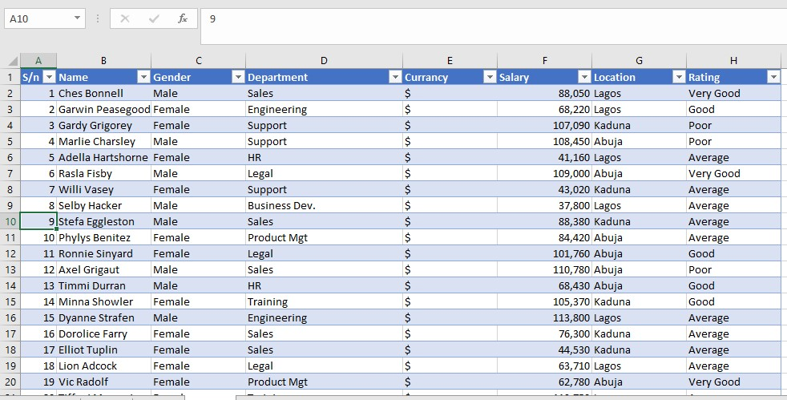
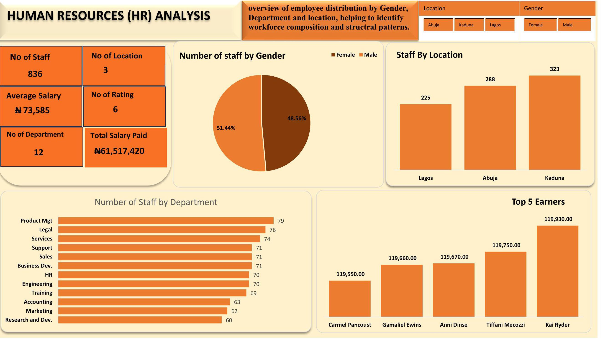
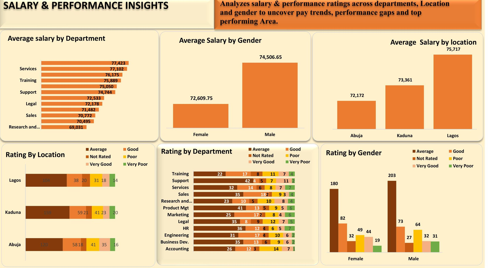

# HR-Analysis-Dashboard

# 📌 Introduction

This project analyzes _HR data_ to uncover insights into workforce distribution, salary patterns, and performance ratings across departments, locations, and gender. The goal is to highlight disparities, identify trends, and provide actionable recommendations for HR decision-making.

# 🗂 Dataset Overview

The dataset includes:

- Employee demographics (gender, location, department)

- Salary levels and averages

- Performance ratings

- Workforce distribution

# 🛠 Tools & Techniques

- Excel Power Query → Data cleaning

- Excel Formulas & Functions → Data manipulation

- Pivot Tables & Charts → Analysis

- Excel Dashboards → Visualization

# 📊 Dashboards
### 1️⃣ Workforce Distribution Dashboard

- _Total staff:_ 836

- _Gender split:_ Male (48.56%), Female (51.44%)

- Locations: Kaduna (323), Abuja (288), Lagos (225)

- Departments: 12 (highest in Product Management & Legal, lowest in R&D)

### 2️⃣ Salary & Performance Insights Dashboard

- Salary by Department: Highest in Services (₦77,423), lowest in R&D (₦69,031)

- Salary by Gender: Male ₦74,506.65 vs Female ₦72,609.75

- Salary by Location: Lagos ₦75,717 > Kaduna ₦73,361 > Abuja ₦72,172

### Performance Ratings:

- High “Not Rated” staff in Abuja (58)

- Services & Support dominate “Average” category

- Females more evenly distributed in ratings; Males concentrated in “Average”

# 💡 Key Insights

- Gender distribution is balanced but a pay gap exists.

- Lagos staff earn more, Abuja lags behind.

- R&D is underfunded with lowest salaries and staff count.

- Appraisal system inconsistent, especially in Abuja.

- Performance ratings cluster around “Average,” showing room for engagement improvement.

# ✅ Recommendations

- Implement equal pay policies to bridge gender gaps.

- Standardize performance appraisals across locations.

- Invest in R&D recruitment and salaries.

- Review salary competitiveness in Abuja.

- Strengthen training & engagement programs to improve performance beyond “Average.”

 # 📖 Conclusion
  
 
 
This HR analysis highlights important workforce and performance patterns. With the right policies and investments, organizations can achieve pay equity, boost employee engagement, and improve overall productivity.
